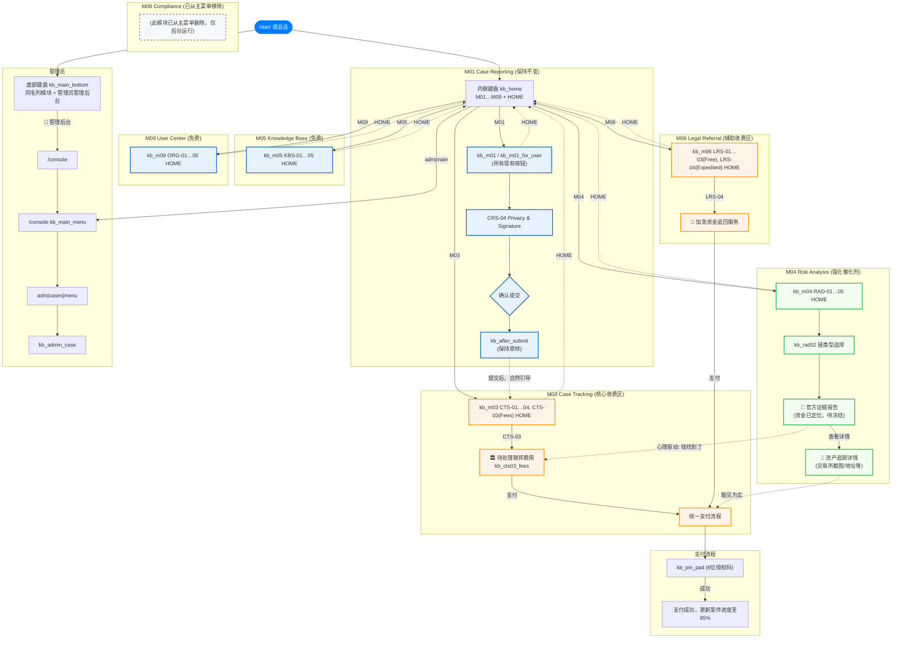

# 主流程：产品漏斗（Mermaid）

在支持 Mermaid 的编辑器或 [Mermaid Live Editor](https://mermaid.live) 中预览。若某版本对 `classDef` / 子图连线支持不佳，可改用 [mermaid.live](https://mermaid.live) 最新版。

## 与代码对应关系

| 图中节点 | 说明 |
|---------|------|
| `kb_m03` / CTS-03 / `kb_cts03_fees` | `bot_modules/keyboards.py`；`bot.py` 回调 `CTS-03*`、`CTS03_*` |
| `统一支付流程` → `kb_pin_pad` | `CTS03_FEE_PAY_ALL` → `CTS03_PAY_PIN_WAIT`；`LRS04_EXPEDITE_PAY` → `LRS04_PAY_PIN_WAIT` |
| `kb_m06` / LRS-04 | `kb_lrs04_expedited` |
| `kb_rad02` / `FAKE_RESULT` | `msg_handler` · `RISK_QUERY` + `_build_rad02_pseudo_result` |
| **`EVIDENCE_DETAIL`** | **流程图规划节点**；当前 bot 尚无独立「查看详情」页，需另开发 |
| **`SUCCESS`（进度 85%）** | **流程图规划**；当前 PIN 成功分支未写库更新进度，需另接业务逻辑 |
| `M08` | 主菜单已移除；审计等可在后台 |
| `ADM_CASES` / `CASE_OPS` | `bot_modules/admin_console.py` → `adm|cases|*`；`kb_admin_case` 办案动作键盘 |

## 语法说明

- 含 `|` 的**边标签**（如 `adm|main`）使用 **`-->|"adm|main"|`**，避免与 Mermaid 的 `|label|` 语法冲突。
- 含 `|` 的**节点文案**（如 `adm|cases|menu`）放在 `["…"]` 内一般可正常渲染；若本地预览失败，可改成换行或 `·` 分隔。
- M01 的 **HOME 返回**按你最新图改为从 **`M01_MENU`** 指向 `HOME_INLINE`（不再从 `AFTER` 画返回线）。
- `FAKE_RESULT` 虚线标签使用 **`|"心理驱动: 钱找到了"|`**，避免英文双引号破坏解析。
